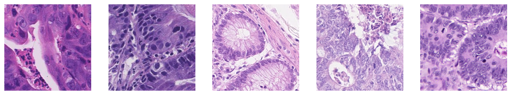

# Histopathology Image Analysis Project

## Overview
This project delves into the intricate world of histopathology image analysis. It aims to automate the identification and counting of various cell types in histopathological images (neutrophil, epithelial, lymphocyte, plasma, eosinophil, connective), a crucial task in medical diagnostics and research. Through this Jupyter notebook, we explore different aspects of image processing, cell differentiation, and data visualization in the realm of digital pathology.

  

## Features
- **Data Exploration**: Examines the distribution of data across different folds, ensuring a comprehensive understanding of the dataset.
- **Image Analysis**: Includes visualization of histopathology images, highlighting the nuances in cell structures and their correlation with cell counts.
- **Pre-processing Techniques**: Demonstrates the application of various image pre-processing methods to enhance the quality and features of the images for better analysis.
- **Implementation of Machine Learning Models**: Shows the implementation of machine learning models for regression (Ordinary Least Squares regression, Support Vector Regression, Convolutional Neural Network)

## Requirements
This project is implemented in a Jupyter notebook environment. The primary dependencies include:
- Python 3.x
- Matplotlib
- Sklearn
- Pytorch
- Torchvision
- Data from https://conic-challenge.grand-challenge.org/

## Installation
To run this notebook, ensure that you have Jupyter Notebook installed. You can install it via [Anaconda](https://www.anaconda.com/products/individual) or pip:

*pip install notebook*
(Install dependencies)
Clone the repository or download the notebook file to your local machine.

## Usage
Launch Jupyter Notebook in your project directory:

*jupyter notebook*

Navigate to the downloaded notebook file and open it to interact with the project.

## Contributing
Suggestions and contributions are welcome! For major changes, please open an issue first to discuss what you would like to change.

## Additonal Notes:
If you are not able to visualize the notebook you can try the following:
- Clear web browser cache and cookies.
- Disable extensions.
- Open in another web browser.

## License
[MIT License](https://choosealicense.com/licenses/mit/)
